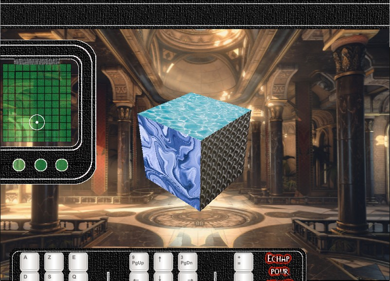

# Micro3D-engine

Micro3D-engine is a lightweight, educational **3D Software Renderer** written in C. Originally developed during my student years, this project was born out of a fascination with 3D graphics and a desire to understand the underlying mechanics of how 3D worlds are projected onto 2D screens.

Unlike modern engines that rely on GPU acceleration (OpenGL, DirectX, or Vulkan), this engine performs all calculations—from vertex transformation to pixel rasterization—entirely on the **CPU**.

[](https://youtu.be/j1Yld8eFJS0?si=Q85ZSOsHQG_2Iinf)

## About the project

The **Micro3D engine** project is a 3D graphics rendering engine implemented from scratch. The engine is a **rasterizer**, the most well-known algorithm for real-time 3D.

The ultimate goal was to recreate a rendering engine using the bare minimum of external libraries. The SDL library was used almost exclusively to provide a function for drawing a point (pixel) with a given color. Everything else—projection, rotation, scaling, texturing (scanlines), and back-face culling—was implemented manually through programming.

_*Note :* This code reflects student work; it is raw, sparsely commented, and variables are not always explicit, but it proves that a 3D world can be built starting from a single pixel._

---

## 🚀 Features

*   **Real-time Rasterization:** Efficient software-based rendering pipeline.
*   **3D Transformations:** Full support for Translation, Rotation, and Scaling.
*   **Perspective Projection:** Converting 3D world coordinates into 2D screen coordinates.
*   **Texture Mapping:** Manual scanline-based implementation for wrapping images onto 3D surfaces.
*   **Back-Face Culling:** Optimization technique to skip rendering polygons facing away from the viewer.
*   **Modernized for SDL3:** Recently migrated from legacy SDL 1.2 to the modern **SDL3** framework.

## 🚧 Roadmap & Limitations

This engine is a foundational tool and currently lacks several advanced features found in production engines:
- [ ] **Z-Buffering:** Depth testing is not yet implemented (relies on draw order).
- [ ] **Camera Transformations:** The view is currently fixed to a world origin.
- [ ] **Clipping:** Handling polygons that intersect the screen boundaries.

## 🎮 Controls (Layout Independent)

The engine uses physical scancodes, making it compatible with both **AZERTY** and **QWERTY** layouts automatically.

| Action | AZERTY Key | QWERTY Key |
| :--- | :--- | :--- |
| **Move Forward/Back** | `Z` / `S` | `W` / `S` |
| **Move Left/Right** | `Q` / `D` | `A` / `D` |
| **Move Up/Down** | `A` / `E` | `Q` / `E` |
| **Rotate** | Arrow Keys | Arrow Keys |
| **Scale Up/Down** | Numpad `+` / `-` | Numpad `+` / `-` |
| **Sound FX** | `F1` - `F12` | `F1` - `F12` |
| **Quit** | `Echap` | `Esc` |

## 🛠️ Technical Stack

*   **Language:** C
*   **API:** SDL3 (Core, Image, Mixer, TTF)
*   **Build System:** CMake
*   **Compiler:** MinGW-w64 (UCRT64)

## 📦 Building and Running

### Prerequisites
1.  **SDL3 Libraries:** Ensure SDL3, SDL3_image, SDL3_mixer, and SDL3_ttf are installed in `C:/SDL3`.
2.  **CMake:** Version 3.16 or higher.
3.  **Compiler:** GCC (MinGW-w64) 64-bit.

### Build Instructions

1. Clone the repository
```bash
git clone https://github.com/kara-abdelaziz/Micro3D-engine.git
cd Micro3D-engine
```
2. Create build directory
```bash
mkdir build
cd build
```
3. Configure and build (Be sure the SDL3 paths in `CMakeLists.txt` matches SDL3 directories)
```bash
cmake ..
cmake --build .
```
4. Launch `build\3DEngine.exe`.

## 🚀 Quick Start (No Compilation Required)

If you want to test the engine immediately without setting up a compiler or CMake, you can download the pre-compiled version for Windows:

1. **Download the bundle:** 
   [Download Micro3D-Engine-Windows.zip](https://github.com/kara-abdelaziz/Micro3D-engine/releases/download/v0.1.0-alpha/Micro3D-Engine-Windows.zip).

2. **Extract the ZIP:** 
   Extract the contents to a folder of your choice. The ZIP contains:
   *   `3DEngine.exe` (The executable)
   *   All required **DLLs** (`SDL3.dll`, `SDL3_image.dll`, etc.)
   *   All necessary **Assets** (`.png`, `.mp3`, `.wav`, `.ttf`)

3. **Run the Engine:** 
   Double-click `3DEngine.exe` to launch the demo.

> **⚠️ Note:** Since this is a custom-built executable, Windows Defender may show a "Windows protected your PC" warning. You may need to click *More info* -> *Run anyway* to start the application.

## Links
- The author website [el-kalam.com](https://www.el-kalam.com)

## 📝 Author's Note

"The code might not be the cleanest you'll find online—it was written 'in the heat of the moment' with non-explicit variables and minimal comments. However, its value lies in the proof that you can build a 3D world starting from a single pixel." 
 
— ***Abdelaziz Kara-***
